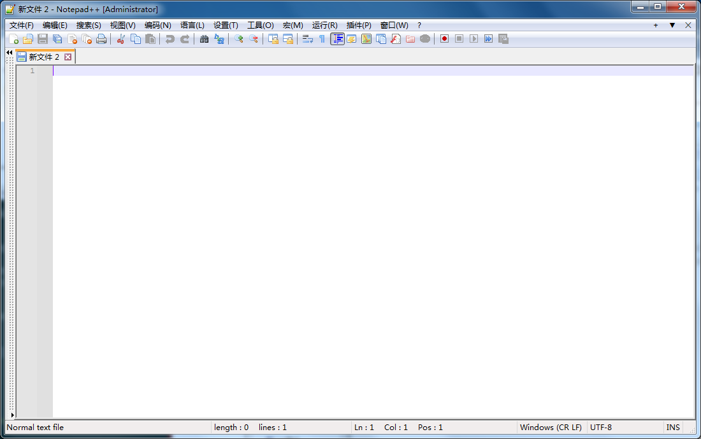
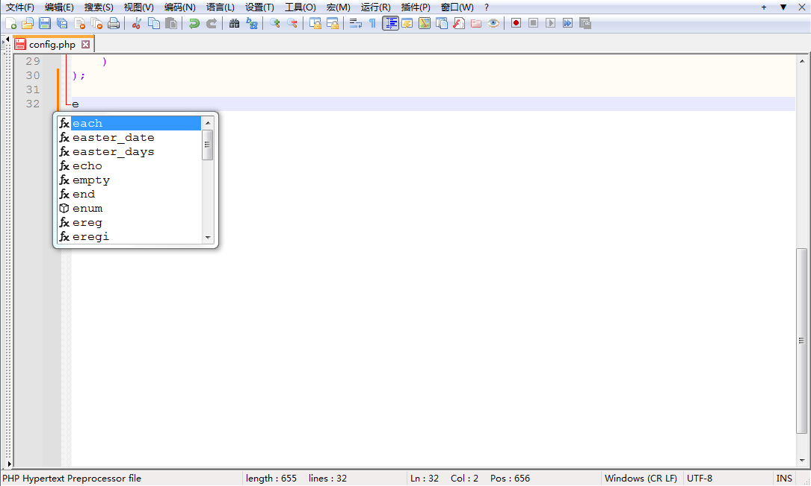

[toc]

### 程序信息

**名称：**Notapad++
**版本：**8.6.4
**适用系统版本：**Win7+

---

无论是做什么工作的，基本都会涉及到编辑信息。

而Windows自带的文本编辑器属实是垃圾中的垃圾，功能稀缺，体验感也不好。

此时一个好的文件编辑器就显得较为重要了。

Notepad++是一个免费、功能强大的文本编辑器，不仅有着普通文件编辑的能力，在编程中也可以给予一定的语法提示，可以为Coder节省点时间。

仅仅4.6MB大小的身躯，却可以承载如此之多的功能，不经感叹那句“麻雀虽小五脏俱全”。

---

### 下载方式

[本站下载](https://hub.tplus.eu.org/Niomaor/dlfiles/raw/master/Notepad_plus_plus_V8.6.4.exe)
[蓝奏云盘下载 - 提取码：note](https://www.lanzouj.com/iHTsM28b6j0h)
[百度网盘下载 - 提取码：note](https://pan.baidu.com/s/1YUGq4SVO0Q7EjQbvST5D8A?pwd=note)
